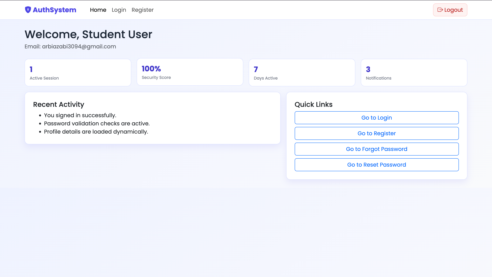
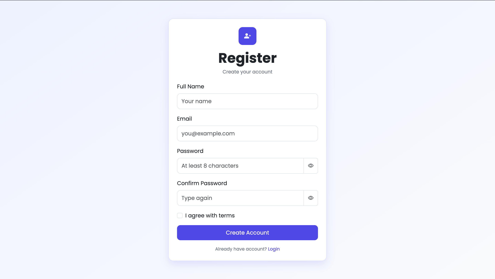
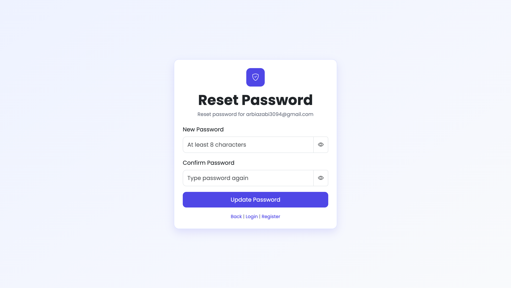

# Authentication System Styling

This project is a simple Bootstrap 5 styled authentication flow with 5 pages:

- `index.html` (Login)
- `register.html` (Registration)
- `forgot-password.html` (Forgot Password)
- `reset-password.html` (Reset Password)
- `dashboard.html` (Dashboard)

It uses one shared stylesheet: `styles.css`.

## Tech Used

- HTML5
- Bootstrap 5.3.3 (CDN)
- Bootstrap Icons 1.11.3 (CDN)
- Custom CSS
- Vanilla JavaScript
- Google Font (Poppins)

## Implemented Requirements

- Bootstrap CDN added in all HTML files
- Bootstrap Icons added in all HTML files
- Custom CSS includes:
  - color theme
  - Google Fonts
  - hover effects for buttons/links
  - box shadows for cards
  - gradient background
  - spacing and transitions
- Responsive for mobile, tablet, laptop, and desktop

## Page Flow

- Login -> Dashboard
- Login -> Register
- Login -> Forgot Password
- Register -> Dashboard
- Register -> Login
- Register -> Forgot Password
- Forgot Password -> Reset Password
- Forgot Password -> Login
- Forgot Password -> Register
- Reset Password -> Login
- Reset Password -> Register
- Dashboard -> Login (Logout)

## Run

Open `index.html` in browser and test all navigation links.

## Screenshots

